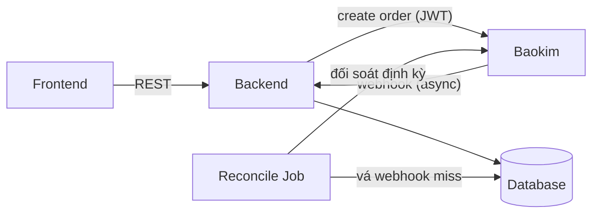
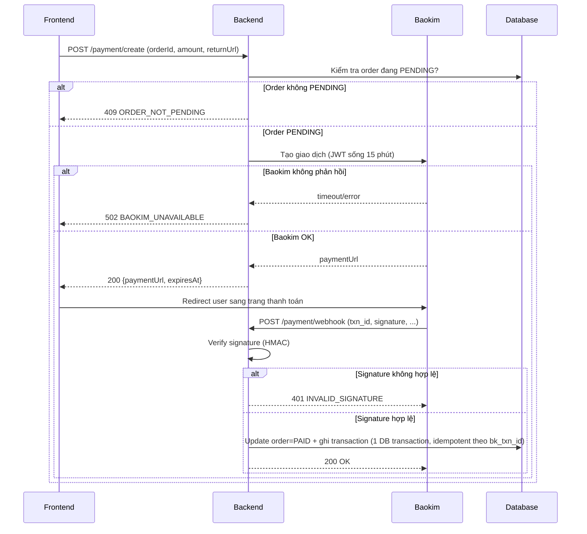
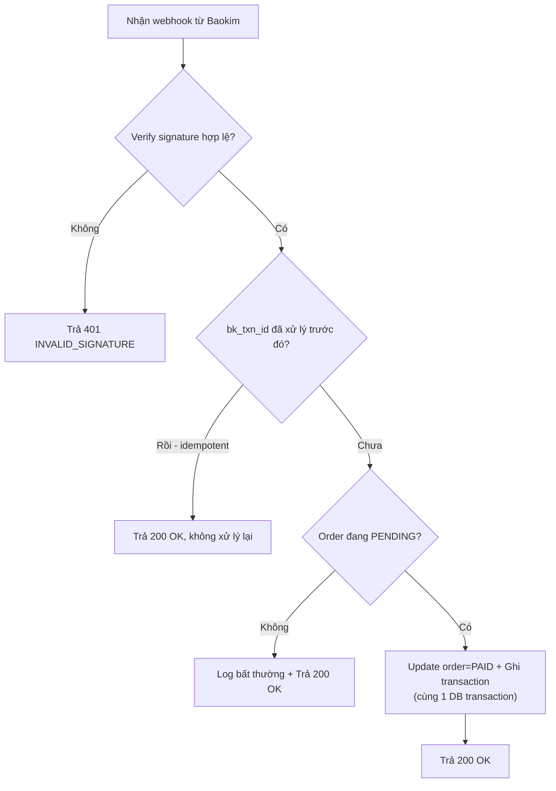
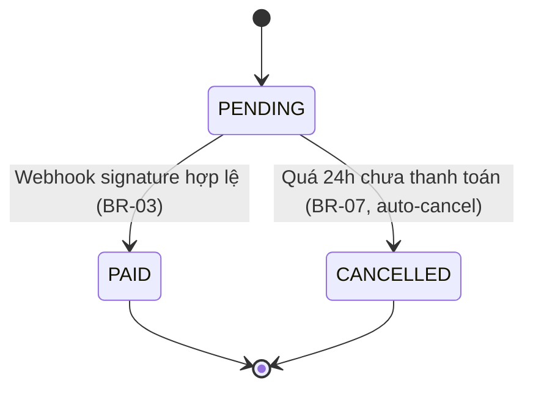
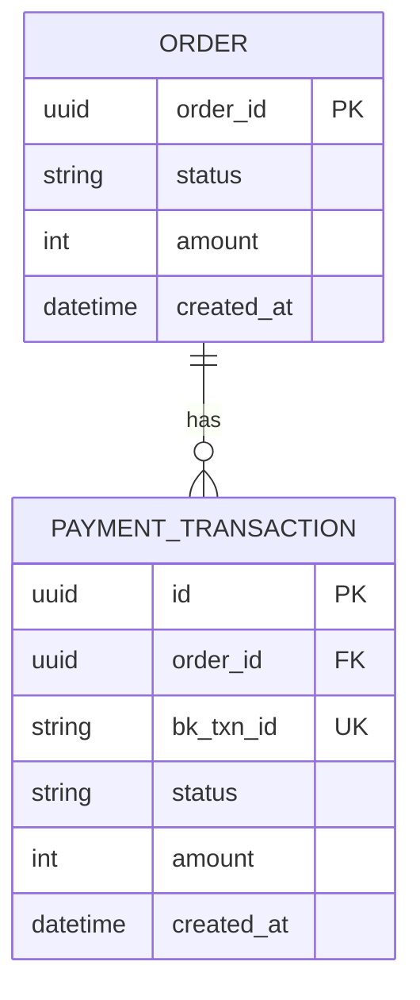

# TDD-BAOKIM-001

## Document Info

- **Feature**: Tích hợp thanh toán Baokim
- **Author**: Danh Nguyen
- **Reviewer**: Tech Lead
- **Status**: Draft
- **Version**: v1.0
- **Updated At**: 2026-07-13

## Context & Goals

### Problem

Khách đang chuyển khoản thủ công, admin đối soát tay → chậm, dễ sai. Cần tự động hoá xác nhận thanh toán qua cổng Baokim.

### Goals

- Khách thanh toán qua Baokim, hệ thống tự xác nhận qua webhook.
- Frontend không giao tiếp trực tiếp với Baokim — mọi request qua backend.

### Non-goals

- Hoàn tiền (refund) — thiết kế ở tài liệu khác.
- Thanh toán trả góp.

## Architecture

Backend là điểm trung gian duy nhất tiếp xúc Baokim. Frontend gọi backend, backend gọi Baokim và xử lý webhook.



**Notes**:

- Backend là điểm trung gian duy nhất tiếp xúc Baokim — FE không giữ secret.
- Reconcile job xử lý trường hợp webhook miss.

## Sequence Diagram

Luồng chính của tích hợp thanh toán — nhấn mạnh 'ai gọi ai, message gì'.



## Activity Diagram

Logic xử lý webhook — nhấn mạnh 'các bước và nhánh rẽ'.



## State Diagram

Vòng đời trạng thái của đơn hàng.



## Data Model

Bảng và quan hệ liên quan tới tính năng. Schema thật nằm ở migration trong repo, đây là bản mô tả thiết kế.



**Notes**:

- bk_txn_id UNIQUE — nền tảng cho idempotency của webhook.
- Update order và ghi transaction trong cùng một DB transaction.

## Internal API

### Endpoints

- **POST** `/payment/create` — Tạo payment request, trả payment URL
- **POST** `/payment/webhook` — Nhận webhook kết quả từ Baokim

### Examples

#### POST /payment/create

```
Request:
{
  "orderId": "550e8400-...", // uuid, đơn phải đang PENDING
  "amount": 350000, // VND, số nguyên, KHÔNG thập phân
  "returnUrl": "https://.../result"
}

Response 200:
{
  "paymentUrl": "https://baokim.vn/pay/...",
  "expiresAt": "2026-07-13T10:30:00+07:00" // JWT sống 15 phút
}

Response lỗi:
{
  "code": "ORDER_NOT_PENDING",
  "message": "..."
}
```

### Error Codes

- **ORDER_NOT_PENDING** (409): Tạo payment cho đơn đã PAID/CANCELLED
- **INVALID_SIGNATURE** (401): Webhook signature verify thất bại
- **PAYMENT_EXPIRED** (410): JWT payment request đã hết hạn
- **BAOKIM_UNAVAILABLE** (502): Baokim không phản hồi khi tạo giao dịch

## External API

### Endpoints

- **Baokim create order** — Tạo giao dịch (cần JWT còn hạn)
- **Baokim webhook** — Nhận kết quả (gọi bất đồng bộ, verify signature)

### Fields

- **signature** — Chữ ký HMAC (verify bắt buộc trước mọi xử lý)
- **txn_id** — Mã giao dịch (dùng làm khoá idempotency)

### Error Handling

Baokim không trả về mã lỗi chuẩn hoá. Cần map response.status_code sang mã nội bộ theo bảng ánh xạ trong repo/error-codes.md.

### Quirks

- Nhanh.vn: filter parentId không chạy server-side → workaround client-side.
- Ahamove: total_fee mới là phí chính thức, không phải estimate.
- Ghi mọi hành vi bất ngờ để người sau không vấp lại.

## References

### User Stories

- HTM-142
- HTM-143

### Business Rules

- BR-03: đơn chỉ PAID khi signature hợp lệ
- BR-07: PENDING 24h → auto-cancel

### Use Cases

- UC-05: Thanh toán đơn hàng

### Others

- OpenAPI spec: repo/openapi.yaml
- Error code registry: repo/error-codes.md
- i18n messages: repo/locales/vi.json
- Tài liệu đối tác: link doc Baokim

## Change Log

#### v1.0 (2026-07-13)

- **Change**: Tạo tài liệu
- **Author**: Tân

#### v1.1 (2026-07-13)

- **Change**: Tách state BE/FE + mapping; chuẩn hoá API Contract (error code registry, tách i18n, code vs message)
- **Author**: Tân
